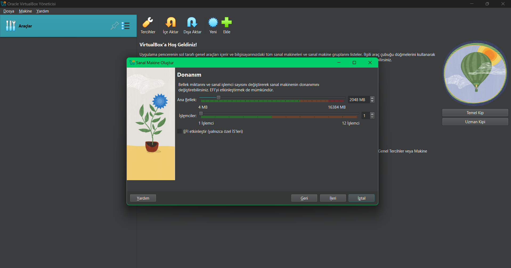

# VirtualBox Üzerinde Ubuntu 24.04 Kurulumu

Bu repo, VirtualBox üzerinde Ubuntu 24.04 kurulumunu adım adım açıklayan bir rehber sunmaktadır. Her adım, görsellerle desteklenmiştir.

## İçindekiler

- [Gerekli Ön Hazırlıklar](#gerekli-ön-hazırlıklar)
- [Kurulum Adımları](#kurulum-adımları)
- [Sonuç](#sonuç)

## Gerekli Ön Hazırlıklar

1. **VirtualBox** programını indirip kurun. İndirme linki: [virtualbox.org](https://www.virtualbox.org/).
2. **Ubuntu 24.04 Desktop ISO** dosyasını indirin. İndirme linki: [ubuntu.com](https://ubuntu.com/download/desktop).

## Kurulum Adımları

### Adım 1: Yeni Sanal Makine Oluşturma
- **VirtualBox**’ı açın ve yeni bir sanal makine oluşturmak için **New** butonuna tıkladım.
- Makine adını "Ubuntu 24.04" olarak girdim, sistem türünü **Linux** ve sürümünü **Ubuntu (64-bit)** olarak seçtim.
- 

### Adım 2: Bellek (RAM) Ayarlama
- Sanal makine için 4 GB RAM ayırdım.
- 

### Adım 3: Sanal Sabit Disk Oluşturma
- **Create a virtual hard disk now** seçeneğini seçtim, disk türünü **VDI** ve **Dynamically allocated** olarak ayarladım.
- Disk boyutunu 20 GB olarak belirledim.
- 

### Adım 4: Ubuntu ISO Dosyasını Bağlama
- **Settings** bölümüne gidip **Storage** kısmından **Empty**’ye tıkladım ve **Ubuntu ISO** dosyasını yükledim.
- 

### Adım 5: Kuruluma Başlama
- Sanal makineyi başlatmak için **Start** butonuna tıkladım.
- Açılan pencerede **Install Ubuntu** seçeneğini seçtim.
- 

### Adım 6: Dil ve Klavye Düzeni Seçme
- Kurulum dilini Türkçe olarak seçtim ve uygun klavye düzenini belirledim.
- 

### Adım 7: Kurulum Türünü Belirleme
- **Normal Installation**’ı ve **Erase disk and install Ubuntu** seçeneğini seçtim, bu sadece sanal disk için geçerli.
- 

### Adım 8: Saat Dilimi Seçimi
- Saat dilimini bulunduğum yere göre ayarladım.
- 

### Adım 9: Kullanıcı Hesabı Oluşturma
- Kullanıcı adı ve parola bilgilerini girerek bir kullanıcı hesabı oluşturdum.
- 

### Adım 10: Kurulumun Tamamlanmasını Bekleme
- Kurulumun bitmesini bekledim, işlem tamamlanınca **Restart Now** ile yeniden başlattım.
- 

### Adım 11: ISO Dosyasını Çıkarma
- Tekrar **Settings** > **Storage** bölümüne gidip ISO dosyasını kaldırdım.
- 

### Adım 12: Ubuntu'yu Kullanma
- Yeniden başlattıktan sonra Ubuntu’ya giriş yaptım ve sistem sorunsuz çalışmaya başladı.
- 

## Sonuç
Bu adımlarla **Ubuntu 24.04**’ü başarıyla VirtualBox üzerinde kurmuş oldum ve sistemi kullanıma hazır hale getirdim.
